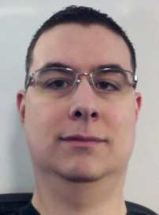

**My name is
Travis Illig.** I'm a .NET developer lead for [Fiserv
Corporation](http://www.fiserv.com) working on next-generation online
banking web applications. You can see more of my online presence at
these places:

-   [Twitter](http://twitter.com/tillig)
-   [Facebook](http://www.facebook.com/tillig)
-   [Google Plus](http://gplus.to/tillig)
-   [Google Profile](http://www.google.com/profiles/travis.illig)
-   [LinkedIn](http://www.linkedin.com/in/tillig)

I believe there is a certain art in solving problems in the computer
science world and I enjoy practicing that art. Note that while all
aspects of that art are interesting to me, my passion lies in technical
leadership and architecture. In animation terms, I prefer to be [a
keyframer](http://en.wikipedia.org/wiki/Key_frame).

When I am not programming for work, I contribute to some open source
projects:

-   [Autofac](https://github.com/autofac/Autofac) (co-owner)
-   [CR\_Documentor](http://code.google.com/p/cr-documentor/) (owner)
-   [CR\_CodeTweet](http://code.google.com/p/cr-codetweet/) (owner)
-   [DXCore Community
    Plugins](http://code.google.com/p/dxcorecommunityplugins/)
    (contributor)
-   [Integrated Authentication for
    Firefox](http://code.google.com/p/firefox-ntlmauth/) (owner)
-   [ImageShackWriterPlugin](http://code.google.com/p/imageshackwriterplugin/)
    (owner)

I also like [playing games](http://live.xbox.com/member/Paraesthesia)
and working on [my media
center](/archive/2008/09/30/overview-of-my-media-center-solution.aspx).

I am open to hearing about new opportunities, but only:

-   Permanent, full-time positions.
-   No relocation. (I'm in the Portland, OR metro area.)
-   Something *very, very compelling*. I'm happy in my present position
    and changing jobs is not something I do lightly.

And, [please, *don't call me* - send email
instead](/archive/2006/11/02/recruiter-pet-peeves.aspx).
I cannot take your calls during the work day.

**Certifications/Affiliations:**

-   Microsoft Certified Solutions Developer (MCSD) in .NET
-   Microsoft Certified Database Administrator (MCDBA) in SQL Server 2000
-   Typemock MVP

You can get [my resume in PDF format here](resume.pdf).

